# 滅火器管理系統
採用原生 JS、HTML、CSS 的滅火器管理系統
## 使用技術
1. HTML5/CSS3
2. JavaScript
3. PHP
4. Mysql
## 安裝專案
1. 下載並安裝 XAMPP、HeidiSQL
2. 把專案放到 XAMPP 目錄的 htdocs 資料夾
3. 開啟 HeidiSQL 並建立資料庫，設定如圖

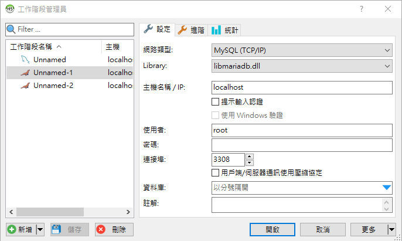

4. 將 Fire_Management.sql 匯入新建的資料庫中
5. 在 XAMPP 控制面板中啟動 Apache 和 Mysql
6. 在 瀏覽器中輸入 localhost/Fire_mesage/
7. 大功告成

## 更改 XAMPP 配置
1. 在 XAMPP 控制面板中選擇 MySQL --> config --> my.ini

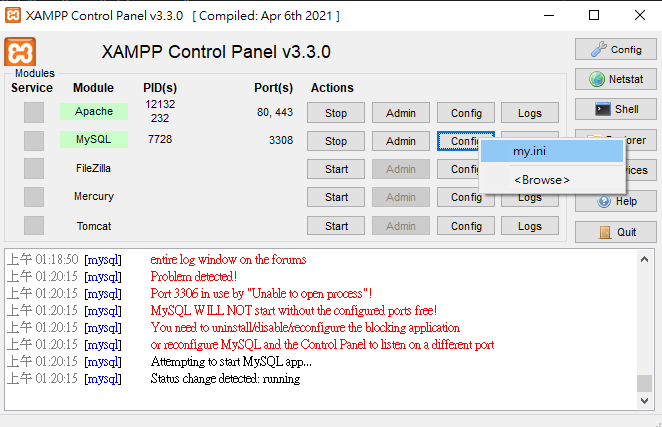

2. 用記事本開啟 my.ini
3. 將 Mysql Post 改成 3308

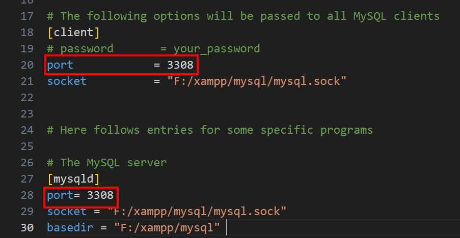

4. 保存並重新啟動 Mysql

## 系統展示

&nbsp;

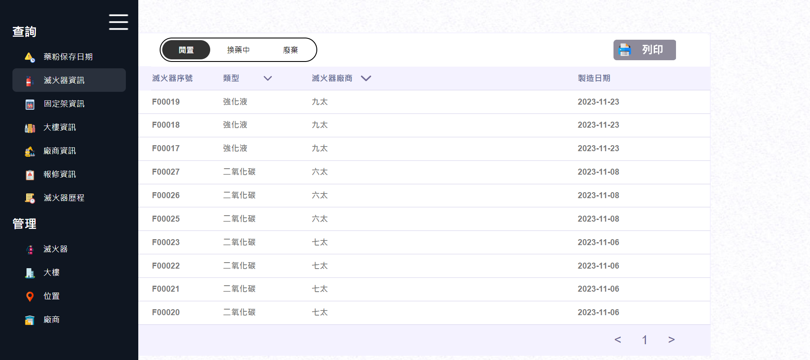</img>

▲ 滅火器選單頁，提供使用者在各項功能中進行切換

&nbsp;

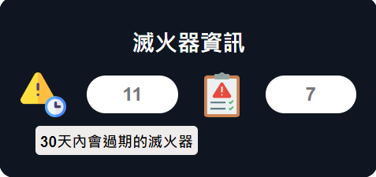</img>

▲ 滅火器資訊頁，系統會顯示 30 天內即將過期的滅火器數量以及尚未完成維修的滅火器數量 

&nbsp;

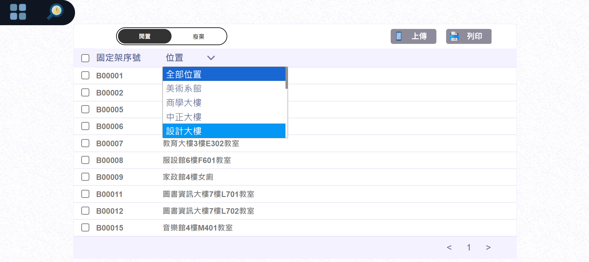</img>

▲ 查詢閒置固定架頁，透過選單列進入後即可直接查詢，可在位置的下拉選單中選擇目標大樓，系統將會根據要求提供目標大樓內的閒置固定架資訊

&nbsp;

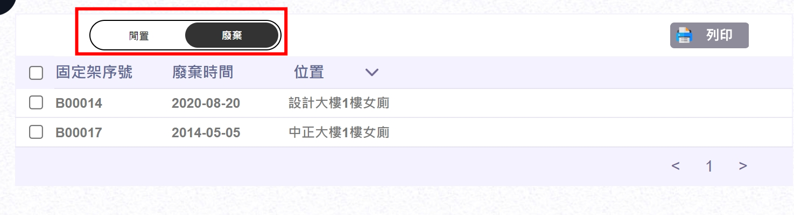</img>

▲ 查詢廢棄固定架頁，透過上方的閒置/廢棄按鈕進行切換，進入後可以知道過去廢棄的固定架資訊 

&nbsp;

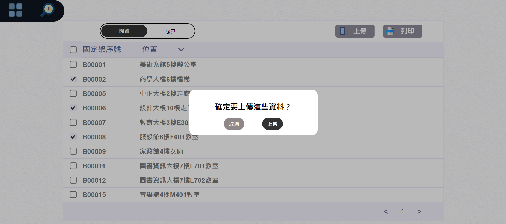</img>

▲ 在查詢功能中勾選需要上傳資料並按下上傳，即可上傳至手機，上傳完成後會傳送成功資訊通知使用者

&nbsp;

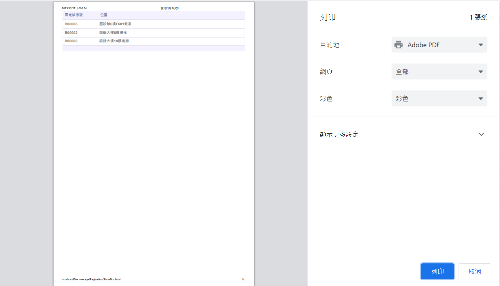</img>

▲ 在查詢功能中勾選需要列印的目標再點選列印即可進行列印

&nbsp;

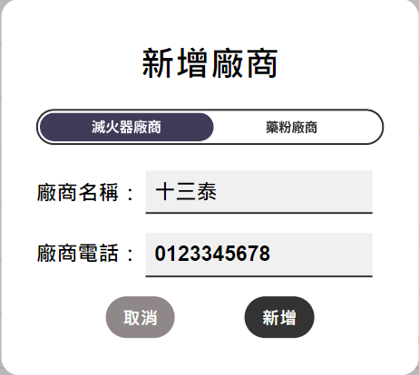</img>
&nbsp;
</img>

▲ 點選新增功能後可以選擇要新增的是滅火器廠商或是藥粉廠商，再輸入資料後系統將會跳出確認視窗讓使用者進行二次確認

&nbsp;

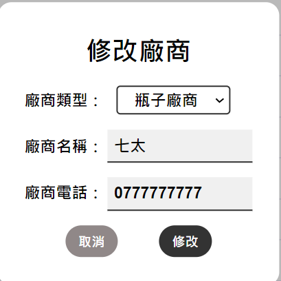</img>

▲ 當發現輸入資料錯誤時可以點選該筆資料進行修改，更改成功後系統會跳出更改成功並且直接顯示更改後資料

